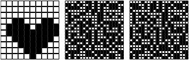
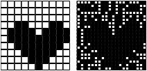
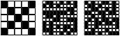
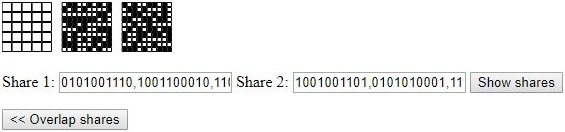

# Visual cryptography
Program allows ciphering an image onto two separate images (with noise). Only when output images are overlapped, the input image can be deciphered.

## How-to cipher
1. Press "Cipher" button at the top of the page,
2. Set columns and rows and press "Set columns/rows" button,
3. Click onto input net on the left side,
4. Press "Cipher >>" button to create new shares,
5. Optionally press "<< Overlap" to check the ciphering result.

## How-to decipher
1. Press "Decipher" button at the top of the page,
2. Write or paste your shares into textboxes at the bottom,
3. Press "Show shares" to check if they are correct,
4. Overlap shares by pressing "<< Overlap shares".

## Warning
This program was written only for educational purposes. The author is aware that the noise level can be so high to make data deciphering impossible.

## Examples
### Ciphering
Heart ciphered onto two shares:  
  
and overlapped:  

### Deciphering
Image that will be rewritten into textboxes:  
  
inserted:  
  
and overlapped:  

